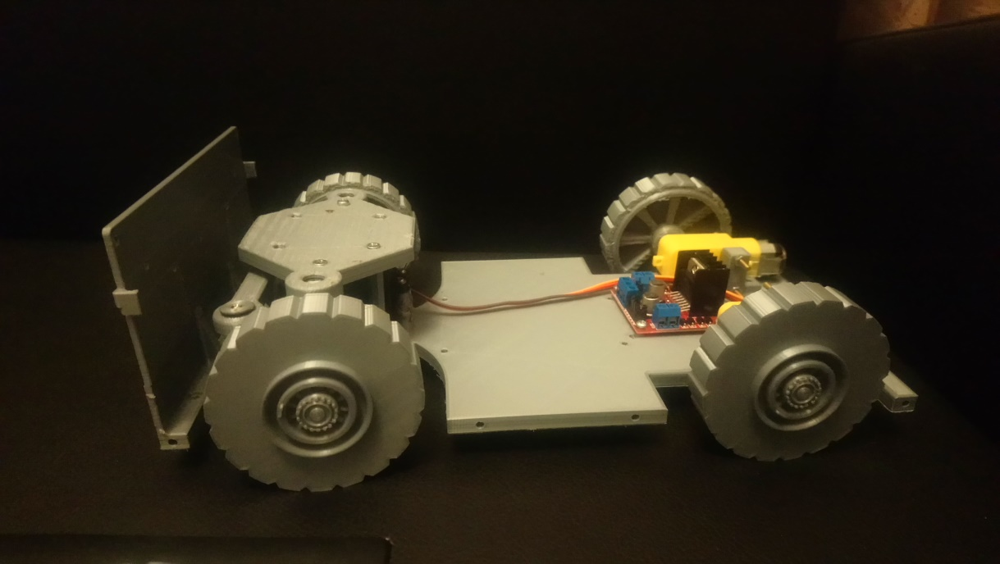
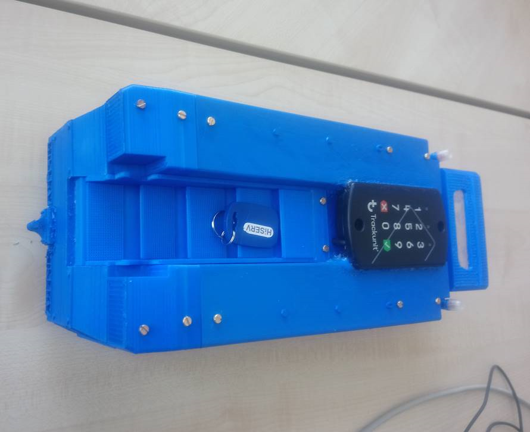
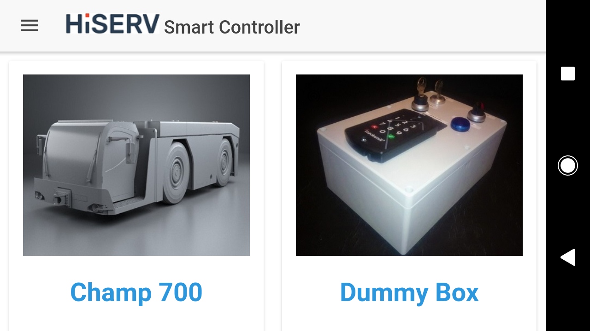

# Challenger-700-Controller
Dieses Projekt dient als demonstrator für den Einsatz von IoT Tracking und Zugangskontrolle Einheiten auf Flugzeugsschlepper (Challenger 700). Das Projekt umfasst:
- ein **Web frontend controller for Challenger 700**
- eine Ionic App controller für Challenger 700 Tractor - Robot
- **Arduino Sketchs** für den **Arduino Mega 2560** und **Arduino Uno** Controller des Challenger 700 Tractor-Robot
- 3D Zeichnungen mit Inventor sowie Zusammenbauten. Für 3D Bauteilen und stl kontaktieren Sie mich unter: fokoboris@gmail.com

Eine Demo der finallen Lösung in dem Video [Demo](assets/Demo.mp4) gesehen werden

## 1. Usecase Diagramm

## 2. Komponent Diagramm

## 3. Prozessüberblick: Fahrzeugsteuerung -  Workflow

## 4. Tracking unit (IoT)
Trackunit Raw mit CAN-Bus (ME 500-4), Zubehör Dual ID Keypad
|  |  |
--- | ---|
|Tracking Raw ME 500 - 4: [Link](https://www.trackunit.com/hardware/raw-faq/)| Zubehör Dual ID Keypad: [Link](https://www.trackunit.com/hardware/accessories/trackunit-dualid-ii/)|

- Kommunikation über Wifi zwischen App und Test-Einheit (Fahrzeug) mit Hilfe eines ESP8266 
- Die Fahrzeugsteuerung soll mit Hilfe eines Arduino basierender Micro Controller umgesetzt  (Es besteht allerdings auch die Möglichkeit, diese mit einem Raspery Py 3 oder andere MicroController umzusetzen)
- Den Datenaustausch zwischen dem Raw 500 – 4 und den Trackunit – Gateway erfolgt über GSM und ist für dieses Projekt vorausgesetzt 

## 5. Schaltkreis: Fritzing Zeichnung

## 6. Realisierung

Die Realisierung erfolgt in zwei verschiedenen Schritten. Zuerst die Konstruktion und den 3D Druck von Bauteilen und anschließend die parallele Entwicklung der Fahrzeugsteuerung und der App (iOS, Android).

### 6.1. 3D Konstruktion
Insgesamt habe ich für die Test-Einheit 28 Bauteile gezeichnet. Hier werden vor allem Baugruppen und einige der wichtigsten Teile dargestellt

#### i. Chassis

Das Chassis ist aufgrund der maximale Drucklänge von 300 mm (3D Drucker bedingt) in zwei Teile gezeichnet worden:
•	Hauptteil: umfasst die Halter für die Vorder- und Hinterräder, sowie die Fläche für den Akku (Li-Ion Batterien), die Stützen für die Motoren und den Mikrocontroller (Arduino)
•	Das vordere Chassis: trägt die Kabine und wird an dem Hauptteil des Chassis angekoppelt.

#### ii.Kabine und Türen

#### iii. Rad & Reifen

#### iV. Zusammenbau

### 6.3. Ergebnisse

#### i.	Fahrzeug: Ergebnis

#### ii. Ionic App: Ergebnis
| Name | Image |
|---|--- |
| App Splash Screen | |
| Startbildschirm | |
| Startbildschirm MenuIcon | |
| Über Uns | |
| Startbildschirm Kontext Menu | |
| Fahrzeugssteuerung | |